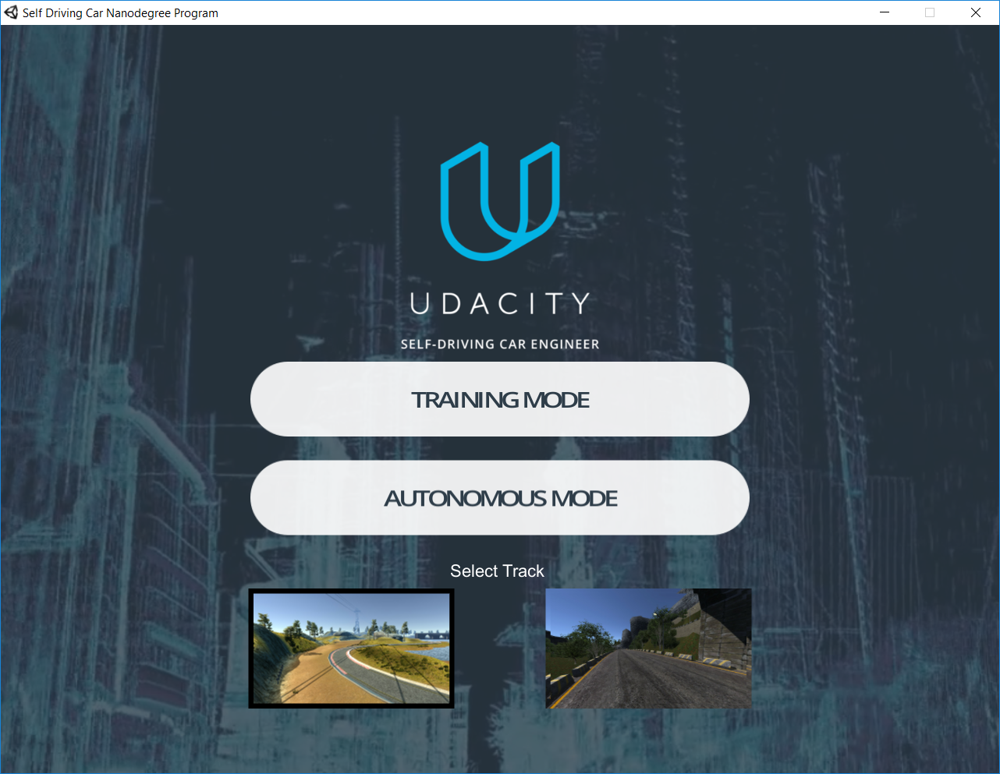
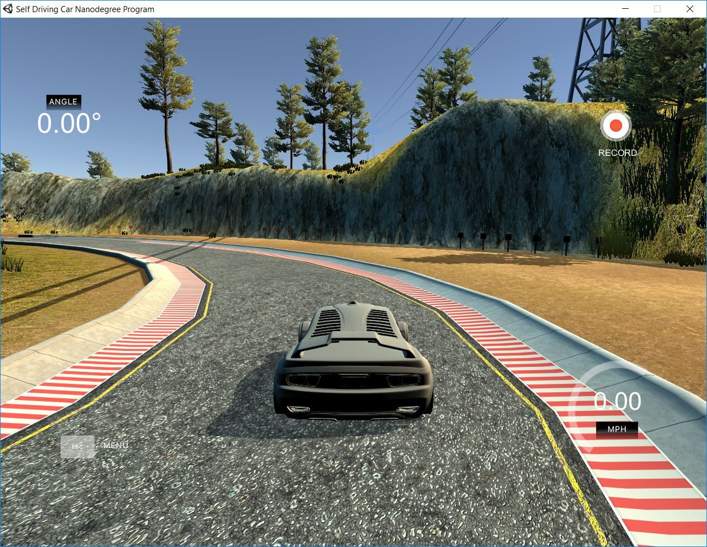

# Self-Driving Car
In this short project we aim to implement a self-driving car algorithm within a simulation environment. 

## The Environment
As environment we use a car driving simulation built by Udacity. The simulation can be found on their GitHub if you follow this [link](https://github.com/udacity/self-driving-car-sim "Link to GitHub"). To use the simulation we further followed these [instructions](https://github.com/udacity/CarND-Behavioral-Cloning-P3 "Link to Instructions")

## The Data
The data to train the neural net can be simply obtained within the given environment. Therefore we start the game in training mode and record the data within the game.

 
<figure>
  

  <figcaption>Fig. 1: (Left) Game menu. (Right) Racetrack. </figcaption>
</figure>
  

## The Network
Our network architecture for the self-driving car is based on the [End to End Learning for Self-Driving Cars](https://arxiv.org/pdf/1604.07316.pdf "Link to Paper") paper which was released by NVIDIA.

### Training
The convolutional network is trained in a supervised manner using backpropagation. It therefore predicts the steering angle and the acceleration from the recorded input images. Then, the error between predicted actions and actions, which correspond to the recorded input images, is computed.

 
<figure>
  

  <figcaption>Fig. 2: Training pipeline.  </figcaption>
</figure>
  

### Architecture
The architecture of the convolutional net takes RGB images as input in a first layer. After normalization, the problem dimension is subsequentially reduced by a number of convolutional layers until the filters are sufficient to extract actions by regression from them. The regression is performed by a stack of fully connected layers.

 
<figure>
  

  <figcaption>Fig. 3: Network architecture.  </figcaption>
</figure>
  

### Prediction
After the network has been successfully trained, one predicts actions only by the frontal input image.
